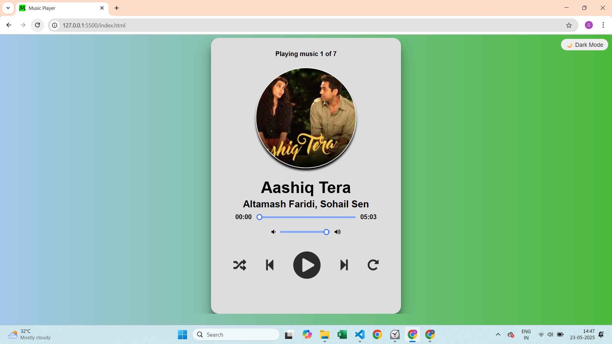
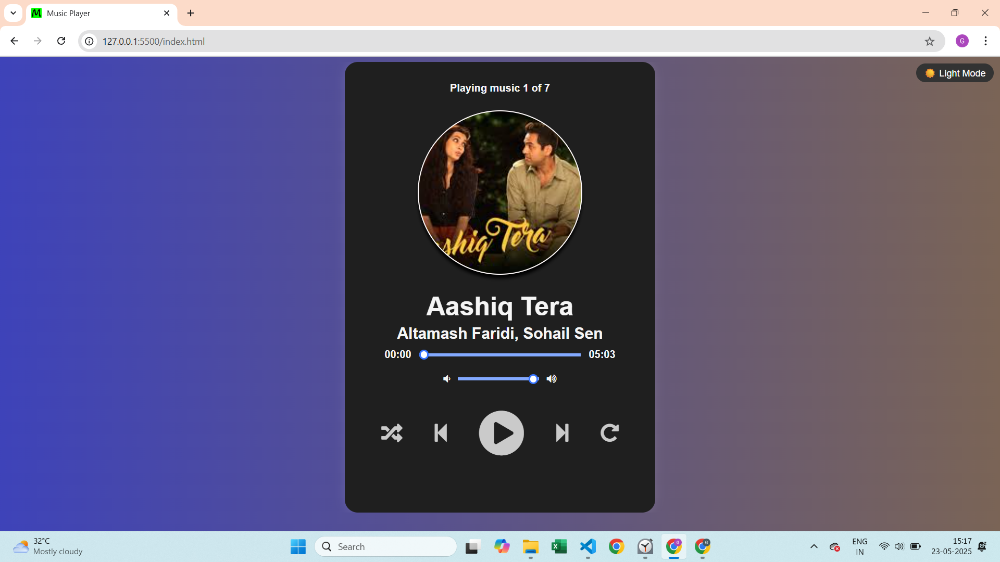
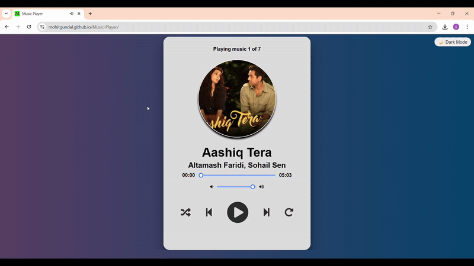

# 🎵 Music Player


A clean and modern 🎶 **Music Player Web App** built using **HTML**, **CSS**, and **Vanilla JavaScript**.  
Enjoy smooth audio playback with visual effects, keyboard shortcuts, and light/dark themes — all fully responsive.

---

## 🚀 Features

- 🔁 Play, Pause, Next, Previous controls
- 🎚 Volume and progress slider
- ⏱ Current time and total duration display
- 🌙 Dark/Light theme toggle
- ⌨️ Keyboard shortcuts (Space: Play/Pause, Arrow keys: Next/Previous)
- 📱 Fully mobile responsive design
- 🎶 Live animated wave effect during playback
- 🎵 Custom favicon for branding

---

## 🌐 Live Demo

👉 [Try the Music Player Live](https://mohitgundal.github.io/music-player)

---

## 📸 Screenshots
## ☀️ Light Mode


## 🌙 Dark Mode


---

## 🎥 Demo in Action (Optional)


---

## 🛠 Tech Stack

- HTML5
- CSS3
- JavaScript (Vanilla)
- Font Awesome

---

## 📁 Folder Structure

Music-Player/
├── images/ # Icons,Album photos, favicon
├── music/ songs
├── index.html # Main HTML file
├── style.css # All CSS styles
├── script.js # Main JavaScript file
└── README.md # Project description

---

## 📌 How to Use

1. Clone the repo:
```bash
git clone https://github.com/mohitgundal/music-player.git
```

2. Navigate to the folder:
```bash
cd music-player
```

3. Open index.html:
Just open the file in your browser — no server needed.


## 📄 License

This project is licensed under the MIT License — see the LICENSE file for details.

---

## 🙋‍♂️ Author
Made with ❤️ by Mohit Gundal
Let’s connect:
📫 [LinkedIn](https://www.linkedin.com/in/mohitbuilds/)  
🌐 [mohitbuilds.com](https://mohitbuilds.com)  
📷 [Instagram](https://www.instagram.com/_mohitbuilds/)


## 🙏 Thank you for checking this out!
If you liked it, consider giving the repo a ⭐ and sharing it with friends 🎧😊
  
